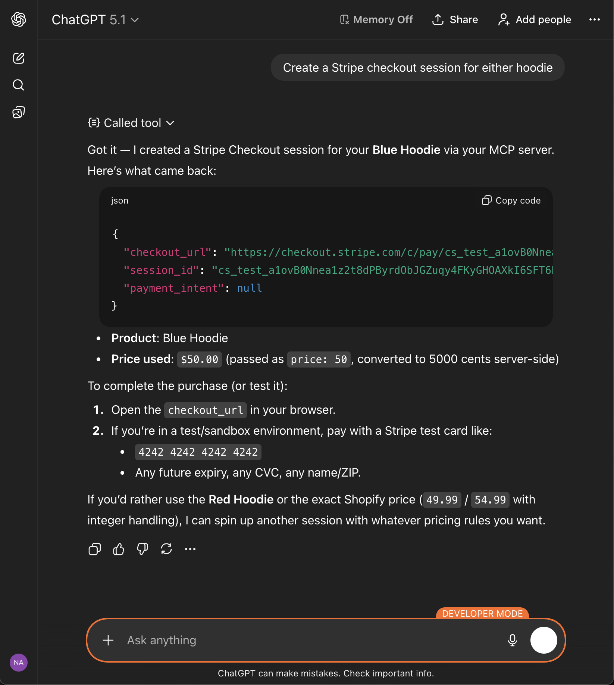

# MCP HTTP Server

[](https://nodejs.org/)
[](LICENSE)
[](https://vercel.com)
[](CHANGELOG.md)

A lightweight commerce-focused MCP server deployed on Vercel. It exposes Shopify product search and Stripe Checkout creation through the Model Context Protocol using HTTP transport and SSE for session state.

## Demo

### Shopify Search via MCP  
ChatGPT calling the `shopify_search_products` tool and returning live store inventory.


### Stripe Checkout Session via MCP  
ChatGPT creating a Stripe Checkout Session end-to-end using the Stripe MCP tool.



## Features

- MCP HTTP transport at `/api/server` (with `/mcp` rewrite) using `mcp-handler`
- Streamable HTTP + SSE via Redis for stateful MCP sessions
- Vercel serverless runtime (Node.js 22) with 60s max execution
- Commerce tools: Shopify product search and Stripe Checkout creation/payment lookups
- Strict Zod validation across tools
- Health & readiness endpoints (`/api/healthz`, `/api/healthz/ready`)
- CORS allowlist optimized for ChatGPT access

## Quick Start

### Prerequisites

- Node.js 22+
- Vercel CLI installed (`npm i -g vercel`)

### Local Development

```bash
cd vercel-server
npm install
npm run dev   # runs `vercel dev` with the MCP route rewrite
```

### Deploy to Vercel

```bash
cd vercel-server
npm install
vercel --prod
```

See `vercel-server/DEPLOYMENT.md` if you need a step-by-step guide for setting env vars in the Vercel dashboard.

## MCP Endpoint

MCP transport served at `/api/server` using `mcp-handler`, with Streamable HTTP and optional SSE-based session state (via Redis).

- **Base path:** `/api/server` (catch-all rewrite from root)
- **Methods:** `GET`, `POST`, `DELETE` (per `mcp-handler`)

Example (list tools):

```bash
curl -X POST https://your-deployment.vercel.app/mcp \
  -H "Content-Type: application/json" \
  -d '{"jsonrpc":"2.0","id":"1","method":"tools/list","params":{}}'
```

## Health Endpoints

- `GET /api/healthz` – liveness check
- `GET /api/healthz/ready` – readiness probe

## Available Tools

- `ping` — Connectivity + MCP handshake validation
- `shopify_search_products` — Query Shopify Admin API for matching products
- `stripe_create_checkout_session` — Create a Stripe-hosted Checkout Session (price interpreted in dollars)
- `stripe_create_checkout_session_legacy` — Create sessions using existing Stripe Price IDs
- `stripe_get_payment_status` — Retrieve payment status for a PaymentIntent

## Configuration

| Variable | Description | Required |
|----------|-------------|----------|
| `REDIS_URL` | Redis connection string (required for SSE session state) | Yes |
| `SHOPIFY_STORE_URL` or `SHOPIFY_SHOP` | Shopify store domain/subdomain | Yes |
| `SHOPIFY_ACCESS_TOKEN` | Shopify Admin API token | Yes |
| `SHOPIFY_API_VERSION` | Shopify API version (default `2024-10`) | Optional |
| `STRIPE_SECRET_KEY` | Stripe secret key | Yes |
| `MCP_SERVER_URL` | Public MCP server URL override | Optional |
| `NEXT_PUBLIC_SITE_URL` | Frontend URL for checkout redirects | Recommended |
| `ALLOWED_ORIGINS` | Comma-separated CORS origins | Optional |

## Project Structure

```
.
├── vercel-server/
│   ├── api/
│   │   ├── server.ts          # MCP handler (catch-all rewrite)
│   │   ├── healthz.ts         # Liveness probe
│   │   └── healthz/
│   │       └── ready.ts       # Readiness probe
│   ├── lib/
│   │   ├── cors.ts            # CORS allowlist + preflight handling
│   │   ├── schemas.ts         # Zod schemas
│   │   ├── utils.ts           # Helper utilities (URLs, errors)
│   │   └── tools/             # Tool implementations
│   │       ├── shopify.ts
│   │       └── stripe.ts
│   ├── vercel.json            # Catch-all rewrite to /api/server
│   └── package.json
├── CHANGELOG.md
├── LICENSE
├── README.md
└── SECURITY.md
```

## Security

- **CORS allowlist** built from ChatGPT origins, optional frontend URL, and env overrides
- **Validated inputs/outputs** via Zod for health responses and tool payloads

## License

MIT - See [LICENSE](LICENSE) for details.
